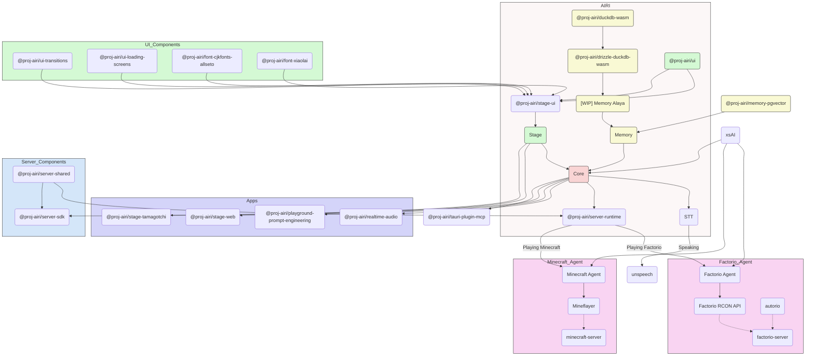

<picture>
  <source
    width="100%"
    srcset="./docs/content/public/banner-dark-1280x640.avif"
    media="(prefers-color-scheme: dark)"
  />
  <source
    width="100%"
    srcset="./docs/content/public/banner-light-1280x640.avif"
    media="(prefers-color-scheme: light), (prefers-color-scheme: no-preference)"
  />
  
</picture>

<h1 align="center">Project AIRI</h1>

<p align="center">Re-creating Neuro-sama, a soul container of AI waifu / virtual characters to bring them into our world.</p>

<p align="center">
  This repository is a maintained downstream fork of <a href="https://github.com/moeru-ai/airi">moeru-ai/airi</a>, focused on keeping the desktop experience usable, integrating high-value upstream ideas selectively, and shipping heavily tested improvements on top of the original project.
</p>

> [!IMPORTANT]
> **Fork context:** This build still credits and depends on the original `moeru-ai/airi` project for its foundation, vision, and broad architecture. The goal here is not to erase that lineage, but to provide a working fork that continues to land practical desktop-focused improvements while upstream changes are reviewed more selectively.

## Why This Fork Exists

This fork exists to keep AIRI moving as a practical daily-driver build instead of waiting on broad upstream history churn to settle.

In this workspace, the priority is:

- keep the desktop path stable and testable
- preserve upstream intent where it is genuinely useful
- selectively forward-port worthwhile upstream work instead of blindly rebasing
- ship tangible UX, performance, and workflow improvements for real usage

If you want the original project history and broader upstream context, see [`moeru-ai/airi`](https://github.com/moeru-ai/airi). If you want the branch that is being actively tuned for usability, this repository is that branch.

## What This Fork Adds

This fork is not just a bugfix branch. It meaningfully expands what AIRI can do on desktop, especially around character setup, stage presentation, speech, proactivity, and everyday usability.

### AIRI Cards Are A Real Character System Here

In upstream, AIRI cards are much thinner. In this fork, the AIRI card flow is treated like an actual character-management system. Cards can be imported, edited, previewed, and exported in ways that are useful for real users instead of just existing as a placeholder.

Each card now has working import and per-card export paths for both AIRI-native JSON and SillyTavern-compatible `chara_card_v2` PNG. Hovering a card surfaces its picture, framed PNG export is supported, and the card itself can carry more of the character's real identity across machines. Setting a card is no longer just a name/description swap either: it can drive the active model, the character's preferred background, and the wider stage presentation around that character. Technical format details live in [`docs/AIRI_Card_Import_Export.md`](./docs/AIRI_Card_Import_Export.md).

This fork also extends card portability well beyond the upstream baseline. AIRI-specific exports preserve things like thumbnails, preferred backgrounds, acting metadata, and other custom extensions. The PNG compatibility path is designed so you can participate in the broader card ecosystem without giving up AIRI-specific data.

### New AIRI Card Tabs That Actually Matter

The card editor has been expanded into a multi-tab configuration surface instead of a thin metadata form.

**Acting** is where you teach AIRI how to perform. It has three prompt layers: one for model expressions and ACT tokens, one for speech-expression tags, and one for speech mannerisms. The point is not just "more fields"; it is to let the same personality speak differently depending on the selected VRM/Live2D model and the active speech provider. The prompts are there so you can align the model's face, the TTS delivery, and the character's writing style instead of leaving all of that implicit.

**Modules** lets a card carry its own model and stage choices. That includes the active chat model, speech provider/model/voice, the selected VRM or Live2D avatar, and the character's preferred background. In practice this means switching characters can switch the whole presentation, not just the text persona.

**Artistry** is brand new and turns image generation into a first-class character capability. Each card can carry an image provider, optional model override, default prompt prefix, widget instruction, and provider-specific JSON options. Right now that is wired around providers like Replicate, with the system shaped so other image APIs can plug in cleanly. ComfyUI support is part of the intended path forward here rather than an afterthought.

**Proactivity** is one of the most important additions in this fork. Instead of treating AIRI as a thing that only answers when spoken to, this tab lets you define when and how the character should decide to speak on her own. The system can inject real context like window history, system load, volume state, and usage metrics into heartbeat evaluations, and the prompt can be tuned so AIRI knows when to remain silent versus when to comment. The goal is not random interruptions; it is to give the character a believable sense of timing, awareness, and restraint.

### Memory Is No Longer Just A Placeholder

This fork now has the beginning of a real character-centric memory system instead of a generic future promise. Memory is scoped per character, so one card's continuity is not silently mixed into another's.

**Short-term memory** now supports rebuilding daily continuity blocks from existing chat history. Those blocks are stored durably and injected back into new or reset sessions so a character can recover recent continuity without replaying the full raw logs. The current implementation is intentionally simple: rebuild from chat history first, store one summary block per day, and keep the prompt-side injection bounded and understandable.

**Long-term memory** now has a working append-only journal path through the new `text_journal` tool. Characters can create journal entries and search them later by keyword, and the Memory settings area now has a real long-term archive view instead of a `WIP` shell. This is designed as a lightweight memory layer that is useful right now, without requiring a separate memory server or a heavyweight external stack just to get durable recall. A sibling **image_journal** feature is also in development to provide similar durable storage for AI-generated art.

**Unified memory lookup** already works across both layers: a search checks the active character's long-term journal first and falls back into short-term memory blocks when the journal has no relevant hit, so retrieval feels like one memory system even though storage remains split.

The broader plan for semantic retrieval, short-term automation, and future image journaling is documented in [`docs/memory-architecture.md`](./docs/memory-architecture.md), [`docs/short-term-memory.md`](./docs/short-term-memory.md), [`docs/long-term-memory.md`](./docs/long-term-memory.md), and [`docs/image-journal-proposal.md`](./docs/image-journal-proposal.md).

### Scene System Is New In This Fork

The Scene Manager is a real feature added here, not a minor tweak. Upstream did not have this broader character-aware background workflow in the same way.

You can upload scene backgrounds, manage them in a gallery, preserve readable names, choose a global default, and override that per character through AIRI cards. Cards can also carry preferred background metadata across export/import so the scene can be restored later instead of being lost as soon as you move machines. Editing the active card can live-apply the selected background so you are not making blind choices.

This makes stage composition much more intentional. Characters can now have their own look and environment instead of sharing one undifferentiated global presentation.

### Tamagotchi / Desktop Stage Improvements

The desktop Tamagotchi experience is one of the areas this fork pushes the hardest. The Control Island is no longer just a minimal tray of generic actions. It has grown into a character-facing stage control surface with new dedicated icons for quick emotions, favorites, and idle-loop cycling, along with stronger refresh behavior, feedback toasts, and better resize handling for the floating desktop window.

That matters because these are the interactions people actually touch all day. The goal of this fork is not only to expose settings somewhere deep in a menu, but to make the live desktop character feel responsive and playful while she is on screen.

### Models, Motion, And Character Presentation Are Much Deeper

This fork pushes both VRM and Live2D much further than the stock setup.

For Live2D, there are dedicated customization surfaces and expression-oriented tools so a model can be tuned instead of merely loaded. For VRM, there are expression controls, better recovery/reset behavior, and a growing motion ecosystem. Idle behavior is no longer just one hardcoded file forever: there is support for customizable idle loops, random idle cycling, and a broader direction toward VRMA-driven character motion. On the desktop side, those motion systems are also surfaced through the Control Island so they are not trapped in settings-only workflows.

The model selector itself is also significantly improved. This fork adds a denser multi-column library layout, better filtering and sorting, and an Explore tab for discovering models and related assets instead of forcing everything through one cramped view. VRMA add-file support is also part of the roadmap.

### Speech And Provider Plumbing Are More Practical

One of the biggest quality-of-life fixes in this fork is speech quality. A major problem in the original stack was the audio degradation introduced by a library choice in the speech path; this fork replaced that weak point so TTS playback quality is materially better.

On top of that, OpenAI-compatible speech providers that expose a voices endpoint can now surface selectable voices in the UI instead of making users guess IDs manually. There is also broader provider work throughout the fork, including Chatterbox integration, local-server quality-of-life improvements, and other compatibility hardening so the app is easier to run with real-world backends.

Streaming support for **DeepSeek** and **GLM-4** models is also hardened in this fork, including proper handling of `reasoning-delta` events and tolerance for malformed ACT tag typos that previously caused prompt stalls.

### Widget System Lets AIRI Compose Desktop Views

The `stage_widgets` tool gives AIRI the ability to spawn, update, and remove floating desktop widgets during conversation. Pre-built widget components exist for weather and map views, and a generic JSON fallback renders any unknown component name as a styled info-card, so the model can "compose" a view for stocks, notes, or anything else without requiring a bespoke UI component.

Widgets are managed through a Tool → IPC → Main Process → Renderer pipeline, with each widget identified by a human-readable id so AIRI can update or remove it later. The system is documented in [`docs/widget-system-report.md`](./docs/widget-system-report.md).

### Per-Character LLM Generation Settings

A planned **Generation** tab in the AIRI card editor will let each character carry its own chat-generation tuning — provider, model, max tokens, temperature, and top-p — instead of relying solely on global defaults. The schema is designed to grow toward SillyTavern preset import and advanced provider-specific JSON later. Design details are in [`docs/Character Configurable LLM.md`](./docs/Character%20Configurable%20LLM.md).

### All Interaction Pipelines Share One Toolchain

In this fork, typed chat, STT-triggered chat, and proactivity heartbeats all consume the same shared `builtinTools` surface. That means new builtin tools like `text_journal` or `stage_widgets` are automatically available across every interaction pipeline without per-surface wiring. The pipeline architecture and common failure-mode documentation lives in [`docs/Chat-STT-Proactive-Pipelines-Design.md`](./docs/Chat-STT-Proactive-Pipelines-Design.md).

### Privacy And Daily-Driver Defaults

This fork also carries smaller but important product decisions that make it easier to recommend as an everyday build. One example is the option in `Settings -> General` to disable cloud sync, with this fork favoring a privacy-respecting local-default posture rather than assuming remote sync should be on.

Overall, the fork is trying to turn AIRI from an interesting base project into something more complete, more character-driven, and more usable as an actual personal desktop companion.

If you want the running journal for what is actively being built, refined, and thought through in this fork, start with [`docs/AIRI_PROGRESS.md`](./docs/AIRI_PROGRESS.md). For the selective upstream strategy used here, see [`docs/PR/Selective Upstream Sync.md`](./docs/PR/Selective%20Upstream%20Sync.md).

<p align="center">
  [<a href="https://discord.gg/TgQ3Cu2F7A">Join Discord Server</a>] [<a href="https://airi.moeru.ai">Try it</a>] [<a href="https://github.com/moeru-ai/airi/blob/main/docs/README.zh-CN.md">简体中文</a>] [<a href="https://github.com/moeru-ai/airi/blob/main/docs/README.ja-JP.md">日本語</a>] [<a href="https://github.com/moeru-ai/airi/blob/main/docs/README.ru-RU.md">Русский</a>] [<a href="https://github.com/moeru-ai/airi/blob/main/docs/README.vi.md">Tiếng Việt</a>] [<a href="https://github.com/moeru-ai/airi/blob/main/docs/README.fr.md">Français</a>] [<a href="https://github.com/moeru-ai/airi/blob/main/docs/README.ko-KR.md">한국어</a>]
</p>

<p align="center">
  <a href="https://deepwiki.com/moeru-ai/airi"></a>
  <a href="https://github.com/moeru-ai/airi/blob/main/LICENSE"></a>
  <a href="https://discord.gg/TgQ3Cu2F7A"></a>
  <a href="https://x.com/proj_airi"></a>
  <a href="https://t.me/+7M_ZKO3zUHFlOThh"></a>
  <a href="./docs/wechat.md"></a>
  <a href="https://qun.qq.com/universal-share/share?ac=1&authKey=9g00d%2BZS7nORzcJugNNddJ7rCghZTIR7fhXabGwch2S%2BG%2BKGIKwlN1N2nIqkh2jg&busi_data=eyJncm91cENvZGUiOiIxMDU4MTU2Njk3IiwidG9rZW4iOiJmcnkra1hWNFIxNytEcG0zcHRUdVJIaldlRDFxN0dzK080QWtvTEdOQjJkNEY2eUFta1g1clNpbkxSMS9FQWFYIiwidWluIjoiMTI2MDkwNzMzNSJ9&data=b1eJrwn3GVOUh7YIxZ7l9vHQo99HPmRxKPpMKlDCmfzx8Y57IXb2EZCMaOC9rVTd2U558qpNjwUYUWlPHxVHvg&svctype=4&tempid=h5_group_info"></a>
</p>

<p float="left" align="center">
  <!-- readme-section:release-binary-windows -->
  <a href="https://github.com/moeru-ai/airi/releases/download/v0.9.0-stable.20260331/AIRI-0.9.0-stable.20260331-windows-x64-setup.exe">
    <picture>
      <source
        width="33%"
        srcset="./docs/content/public/assets/download-buttons/download-buttons.windows.dark.en-US.avif"
        media="(prefers-color-scheme: dark)"
      />
      <source
        width="33%"
        srcset="./docs/content/public/assets/download-buttons/download-buttons.windows.light.en-US.avif"
        media="(prefers-color-scheme: light), (prefers-color-scheme: no-preference)"
      />
      
    </picture>
  </a>
  <!-- readme-section:release-binary-macos -->
  <a href="https://github.com/moeru-ai/airi/releases/download/v0.9.0-stable.20260331/AIRI-0.9.0-stable.20260331-darwin-arm64.dmg">
    <picture>
      <source
        width="33%"
        srcset="./docs/content/public/assets/download-buttons/download-buttons.macos.dark.en-US.avif"
        media="(prefers-color-scheme: dark)"
      />
      <source
        width="33%"
        srcset="./docs/content/public/assets/download-buttons/download-buttons.macos.light.en-US.avif"
        media="(prefers-color-scheme: light), (prefers-color-scheme: no-preference)"
      />
      
    </picture>
  </a>
  <a href="https://github.com/moeru-ai/airi/releases/latest">
    <picture>
      <source
        width="33%"
        srcset="./docs/content/public/assets/download-buttons/download-buttons.linux.dark.en-US.avif"
        media="(prefers-color-scheme: dark)"
      />
      <source
        width="33%"
        srcset="./docs/content/public/assets/download-buttons/download-buttons.linux.light.en-US.avif"
        media="(prefers-color-scheme: light), (prefers-color-scheme: no-preference)"
      />
      
    </picture>
  </a>
</p>
<p float="left" align="center">
  <a href="https://airi.moeru.ai">
    <picture>
      <source
        width="33%"
        srcset="./docs/content/public/assets/download-buttons/download-buttons.mobile.dark.en-US.avif"
        media="(prefers-color-scheme: dark)"
      />
      <source
        width="33%"
        srcset="./docs/content/public/assets/download-buttons/download-buttons.mobile.light.en-US.avif"
        media="(prefers-color-scheme: light), (prefers-color-scheme: no-preference)"
      />
      
    </picture>
  </a>
  <a href="https://airi.moeru.ai">
    <picture>
      <source
        width="33%"
        srcset="./docs/content/public/assets/download-buttons/download-buttons.browser.dark.en-US.avif"
        media="(prefers-color-scheme: dark)"
      />
      <source
        width="33%"
        srcset="./docs/content/public/assets/download-buttons/download-buttons.browser.light.en-US.avif"
        media="(prefers-color-scheme: light), (prefers-color-scheme: no-preference)"
      />
      
    </picture>
  </a>
</p>

<p align="center">
  <a href="https://www.producthunt.com/products/airi?embed=true&utm_source=badge-featured&utm_medium=badge&utm_source=badge-airi" target="_blank"></a>
  <a href="https://trendshift.io/repositories/14636" target="_blank"></a>
</p>

> Heavily inspired by [Neuro-sama](https://www.youtube.com/@Neurosama)

> [!WARNING]
> **Attention:** We **do not** have any officially minted cryptocurrency or token associated with this project. Please check the information and proceed with caution.

> [!NOTE]
>
> We've got a whole dedicated organization [@proj-airi](https://github.com/proj-airi) for all the sub-projects born from Project AIRI. Check it out!
>
> RAG, memory system, embedded database, icons, Live2D utilities, and more!

> [!TIP]
> We have a translation project on [Crowdin](https://crowdin.com/project/proj-airi). If you find any inaccurate translations, feel free to contribute improvements there.
> <a href="https://crowdin.com/project/proj-airi" target="_blank" rel="nofollow"></a>

Have you dreamed about having a cyber living being (cyber waifu, digital pet) or digital companion that could play with and talk to you?

With the power of modern large language models like [ChatGPT](https://chatgpt.com) and famous [Claude](https://claude.ai), asking a virtual being to roleplay and chat with us is already easy enough for everyone. Platforms like [Character.ai (a.k.a. c.ai)](https://character.ai) and [JanitorAI](https://janitorai.com/) as well as local playgrounds like [SillyTavern](https://github.com/SillyTavern/SillyTavern) are already good-enough solutions for a chat based or visual adventure game like experience.

> But, what about the abilities to play games? And see what you are coding at? Chatting while playing games, watching videos, and is capable of doing many other things.

Perhaps you know [Neuro-sama](https://www.youtube.com/@Neurosama) already. She is currently the best virtual streamer capable of playing games, chatting, and interacting with you and the participants. Some also call this kind of being "digital human." **Sadly, as it's not open sourced, you cannot interact with her after her live streams go offline**.

Therefore, this project, AIRI, offers another possibility here: **let you own your digital life, cyber living, easily, anywhere, anytime**.

## DevLogs We Posted & Recent Updates

- [DevLog @ 2026.02.16](https://airi.moeru.ai/docs/en/blog/DevLog-2026.02.16/) on February 16, 2026
- [DevLog @ 2026.01.01](https://airi.moeru.ai/docs/en/blog/DevLog-2026.01.01/) on January 1, 2026
- [DevLog @ 2025.10.20](https://airi.moeru.ai/docs/en/blog/DevLog-2025.10.20/) on October 20, 2025
- [DevLog @ 2025.08.05](https://airi.moeru.ai/docs/en/blog/DevLog-2025.08.05/) on August 5, 2025
- [DevLog @ 2025.08.01](https://airi.moeru.ai/docs/en/blog/DevLog-2025.08.01/) on August 1, 2025
- [DreamLog 0x1](https://airi.moeru.ai/docs/en/blog/dreamlog-0x1/) on June 16, 2025
- ...more on [documentation site](https://airi.moeru.ai/docs/en/)

## What's So Special About This Project?

Unlike the other AI driven VTuber open source projects, アイリ was built with support of many Web technologies such as [WebGPU](https://www.w3.org/TR/webgpu/), [WebAudio](https://developer.mozilla.org/en-US/docs/Web/API/Web_Audio_API), [Web Workers](https://developer.mozilla.org/en-US/docs/Web/API/Web_Workers_API/Using_web_workers), [WebAssembly](https://webassembly.org/), [WebSocket](https://developer.mozilla.org/en-US/docs/Web/API/WebSocket), etc. from the first day.

> [!TIP]
> Worrying about the performance drop since we are using Web related technologies?
>
> Don't worry, while Web browser version is meant to give an insight about how much we can push and do inside browsers, and webviews, we will never fully rely on this, the desktop version of AIRI is capable of using native [NVIDIA CUDA](https://developer.nvidia.com/cuda-toolkit) and [Apple Metal](https://developer.apple.com/metal/) by default (thanks to HuggingFace & beloved [candle](https://github.com/huggingface/candle) project), without any complex dependency managements, considering the tradeoff, it was partially powered by Web technologies for graphics, layouts, animations, and the WIP plugin systems for everyone to integrate things.

This means that **アイリ is capable of running on modern browsers and devices** and even on mobile devices (already done with PWA support). This brings a lot of possibilities for us (the developers) to build and extend the power of アイリ VTuber to the next level, while still leaving the flexibilities for users to enable features that requires TCP connections or other non-Web technologies such as connecting to a Discord voice channel or playing Minecraft and Factorio with friends.

> [!NOTE]
>
> We are still in the early stage of development where we are seeking out talented developers to join us and help us to make アイリ a reality.
>
> It's ok if you are not familiar with Vue.js, TypeScript, and devtools required for this project, you can join us as an artist, designer, or even help us to launch our first live stream.
>
> Even if you are a big fan of React, Svelte or even Solid, we welcome you. You can open a sub-directory to add features that you want to see in アイリ, or would like to experiment with.
>
> Fields (and related projects) that we are looking for:
>
> - Live2D modeller
> - VRM modeller
> - VRChat avatar designer
> - Computer Vision
> - Reinforcement Learning
> - Speech Recognition
> - Speech Synthesis
> - ONNX Runtime
> - Transformers.js
> - vLLM
> - WebGPU
> - Three.js
> - WebXR ([checkout the another project](https://github.com/moeru-ai/chat) we have under the @moeru-ai organization)
>
> **If you are interested, why not introduce yourself here? [Would like to join part of us to build AIRI?](https://github.com/moeru-ai/airi/discussions/33)**

## Current Progress

Capable of

- [x] Brain
  - [x] Play [Minecraft](https://www.minecraft.net)
  - [x] Play [Factorio](https://www.factorio.com) (WIP, but [PoC and demo available](https://github.com/moeru-ai/airi-factorio))
  - [x] Chat in [Telegram](https://telegram.org)
  - [x] Chat in [Discord](https://discord.com)
  - [x] Memory
    - [x] Pure in-browser database support (DuckDB WASM | `pglite`)
    - [x] Short-term memory rebuild from per-character chat history
    - [x] Short-term continuity injection into new/reset sessions
    - [x] Long-term `text_journal` create/search tools
    - [x] Long-term per-character journal archive UI
    - [x] Unified memory lookup fallback (long-term → short-term)
    - [ ] Memory Alaya (WIP)
  - [ ] Pure in-browser local (WebGPU) inference
- [x] Ears
  - [x] Audio input from browser
  - [x] Audio input from [Discord](https://discord.com)
  - [x] Client side speech recognition
  - [x] Client side talking detection
- [x] Mouth
  - [x] [ElevenLabs](https://elevenlabs.io/) voice synthesis
- [x] Body
  - [x] VRM support
    - [x] Control VRM model
  - [x] VRM model animations
    - [x] Auto blink
    - [x] Auto look at
    - [x] Idle eye movement
  - [x] Live2D support
    - [x] Control Live2D model
  - [x] Live2D model animations
    - [x] Auto blink
    - [x] Auto look at
    - [x] Idle eye movement
- [x] Desktop widgets
  - [x] `stage_widgets` tool (spawn / update / remove)
  - [x] Pre-built weather and map widgets
  - [x] Generic JSON fallback for arbitrary data
  - [x] Artistry / image generation via widget pipeline
- [ ] Shared builtin toolchain across chat, STT, and proactivity pipelines (Proactivity: **DISABLED** for tuning)
- [ ] Refactor Proactivity Sensors: Transition from PowerShell to native integration (Injeca/Eventa) currently causing main-thread lag (INP >1s).

## Development

> For detailed instructions to develop this project, follow [CONTRIBUTING.md](./.github/CONTRIBUTING.md)

> [!NOTE]
> By default, `pnpm dev` will start the development server for the Stage Web (browser version). If you would
> like to try developing the desktop version, please make sure you read [CONTRIBUTING.md](./.github/CONTRIBUTING.md)
> to setup the environment correctly.

```shell
pnpm i
pnpm dev
```

### Stage Web (Browser Version at [airi.moeru.ai](https://airi.moeru.ai))

```shell
pnpm dev
```

### Stage Tamagotchi (Desktop Version)

```shell
pnpm dev:tamagotchi
```

A Nix package for Tamagotchi is included. To run airi with Nix, first make sure to enable flakes, then run:

```shell
nix run github:moeru-ai/airi
```

#### NixOS

Electron requires shared libraries that aren't in standard paths on NixOS. Use the FHS shell defined in `flake.nix`:

```shell
nix develop .#fhs
pnpm dev:tamagotchi
```

### Stage Pocket (Mobile Version)

Start the development server for the capacitor:

```shell
pnpm dev:pocket:ios <DEVICE_ID_OR_SIMULATOR_NAME>
# Or
CAPACITOR_DEVICE_ID=<DEVICE_ID_OR_SIMULATOR_NAME> pnpm dev:pocket:ios
```

You can see the list of available devices and simulators by running `pnpm exec cap run ios --list`.

If you need to connect server channel on pocket in wireless mode, you need to start tamagotchi as root:

```shell
sudo pnpm dev:tamagotchi
```

Then enable secure websocket in tamagotchi `settings/system/general`.

### Documentation Site

```shell
pnpm dev:docs
```

### Publish

Please update the version in `Cargo.toml` after running `bumpp`:

```shell
npx bumpp --no-commit --no-tag
```

## Support of LLM API Providers (powered by [xsai](https://github.com/moeru-ai/xsai))

- [x] [AIHubMix (recommended)](https://aihubmix.com/?aff=OOiX)
- [x] [OpenRouter](https://openrouter.ai/)
- [x] [vLLM](https://github.com/vllm-project/vllm)
- [x] [SGLang](https://github.com/sgl-project/sglang)
- [x] [Ollama](https://github.com/ollama/ollama)
- [x] [302.AI (sponsored)](https://share.302.ai/514k2v)
- [x] [OpenAI](https://platform.openai.com/docs/guides/gpt/chat-completions-api)
  - [ ] [Azure OpenAI API](https://learn.microsoft.com/en-us/azure/ai-services/openai/reference) (PR welcome)
- [x] [Anthropic Claude](https://anthropic.com)
  - [ ] [AWS Claude](https://docs.anthropic.com/en/api/claude-on-amazon-bedrock) (PR welcome)
- [x] [DeepSeek](https://www.deepseek.com/)
- [x] [Qwen](https://help.aliyun.com/document_detail/2400395.html)
- [x] [Google Gemini](https://developers.generativeai.google)
- [x] [xAI](https://x.ai/)
- [x] [Groq](https://wow.groq.com/)
- [x] [Mistral](https://mistral.ai/)
- [x] [Cloudflare Workers AI](https://developers.cloudflare.com/workers-ai/)
- [x] [Together.ai](https://www.together.ai/)
- [x] [Fireworks.ai](https://www.together.ai/)
- [x] [Novita](https://www.novita.ai/)
- [x] [Zhipu](https://bigmodel.cn)
- [x] [SiliconFlow](https://cloud.siliconflow.cn/i/rKXmRobW)
- [x] [Stepfun](https://platform.stepfun.com/)
- [x] [Baichuan](https://platform.baichuan-ai.com)
- [x] [Minimax](https://api.minimax.chat/)
- [x] [Moonshot AI](https://platform.moonshot.cn/)
- [x] [ModelScope](https://modelscope.cn/docs/model-service/API-Inference/intro)
- [x] [Player2](https://player2.game/)
- [x] [Tencent Cloud](https://cloud.tencent.com/document/product/1729)
- [ ] [Sparks](https://www.xfyun.cn/doc/spark/Web.html) (PR welcome)
- [ ] [Volcano Engine](https://www.volcengine.com/experience/ark?utm_term=202502dsinvite&ac=DSASUQY5&rc=2QXCA1VI) (PR welcome)

## Sub-projects Born from This Project

- [Awesome AI VTuber](https://github.com/proj-airi/awesome-ai-vtuber): A curated list of AI VTubers and related projects
- [`unspeech`](https://github.com/moeru-ai/unspeech): Universal endpoint proxy server for `/audio/transcriptions` and `/audio/speech`, like LiteLLM but for any ASR and TTS
- [`hfup`](https://github.com/moeru-ai/hfup): tools to help on deploying, bundling to HuggingFace Spaces
- [`xsai-transformers`](https://github.com/moeru-ai/xsai-transformers): Experimental [🤗 Transformers.js](https://github.com/huggingface/transformers.js) provider for [xsAI](https://github.com/moeru-ai/xsai).
- [WebAI: Realtime Voice Chat](https://github.com/proj-airi/webai-realtime-voice-chat): Full example of implementing ChatGPT's realtime voice from scratch with VAD + STT + LLM + TTS.
- [`@proj-airi/drizzle-duckdb-wasm`](https://github.com/moeru-ai/airi/tree/main/packages/drizzle-duckdb-wasm/README.md): Drizzle ORM driver for DuckDB WASM
- [`@proj-airi/duckdb-wasm`](https://github.com/moeru-ai/airi/tree/main/packages/duckdb-wasm/README.md): Easy to use wrapper for `@duckdb/duckdb-wasm`
- [`tauri-plugin-mcp`](https://github.com/moeru-ai/airi/blob/main/crates/tauri-plugin-mcp/README.md): A Tauri plugin for interacting with MCP servers.
- [AIRI Factorio](https://github.com/moeru-ai/airi-factorio): Allow AIRI to play Factorio.
- [AIRI DomeKeeper](https://github.com/proj-airi/game-playing-ai-dome-keeper): Allow AIRI to play DomeKeeper.
- [Factorio RCON API](https://github.com/nekomeowww/factorio-rcon-api): RESTful API wrapper for Factorio headless server console
- [`autorio`](https://github.com/moeru-ai/airi-factorio/tree/main/packages/autorio): Factorio automation library
- [`tstl-plugin-reload-factorio-mod`](https://github.com/moeru-ai/airi-factorio/tree/main/packages/tstl-plugin-reload-factorio-mod): Reload Factorio mod when developing
- [Velin](https://github.com/luoling8192/velin): Use Vue SFC and Markdown to write easy to manage stateful prompts for LLM
- [`demodel`](https://github.com/moeru-ai/demodel): Easily boost the speed of pulling your models and datasets from various of inference runtimes.
- [`inventory`](https://github.com/moeru-ai/inventory): Centralized model catalog and default provider configurations backend service
- [MCP Launcher](https://github.com/moeru-ai/mcp-launcher): Easy to use MCP builder & launcher for all possible MCP servers, just like Ollama for models!
- [🥺 SAD](https://github.com/moeru-ai/sad): Documentation and notes for self-host and browser running LLMs.



## Similar Projects

### Open sourced ones

- [kimjammer/Neuro: A recreation of Neuro-Sama originally created in 7 days.](https://github.com/kimjammer/Neuro): very well completed implementation.
- [SugarcaneDefender/z-waif](https://github.com/SugarcaneDefender/z-waif): Great at gaming, autonomous, and prompt engineering
- [semperai/amica](https://github.com/semperai/amica/): Great at VRM, WebXR
- [elizaOS/eliza](https://github.com/elizaOS/eliza): Great examples and software engineering on how to integrate agent into various of systems and APIs
- [ardha27/AI-Waifu-Vtuber](https://github.com/ardha27/AI-Waifu-Vtuber): Great about Twitch API integrations
- [InsanityLabs/AIVTuber](https://github.com/InsanityLabs/AIVTuber): Nice UI and UX
- [IRedDragonICY/vixevia](https://github.com/IRedDragonICY/vixevia)
- [t41372/Open-LLM-VTuber](https://github.com/t41372/Open-LLM-VTuber)
- [PeterH0323/Streamer-Sales](https://github.com/PeterH0323/Streamer-Sales)

### Non-open-sourced ones

- https://clips.twitch.tv/WanderingCaringDeerDxCat-Qt55xtiGDSoNmDDr https://www.youtube.com/watch?v=8Giv5mupJNE
- https://clips.twitch.tv/TriangularAthleticBunnySoonerLater-SXpBk1dFso21VcWD
- https://www.youtube.com/@NOWA_Mirai

## Project Status


## Acknowledgements

- [Reka UI](https://github.com/unovue/reka-ui): for designing the documentation site, the new landing page is based on this, as well as implementing a massive amount of UI components. (shadcn-vue is using Reka UI as the headless, do checkout!)
- [pixiv/ChatVRM](https://github.com/pixiv/ChatVRM)
- [josephrocca/ChatVRM-js: A JS conversion/adaptation of parts of the ChatVRM (TypeScript) code for standalone use in OpenCharacters and elsewhere](https://github.com/josephrocca/ChatVRM-js)
- Design of UI and style was inspired by [Cookard](https://store.steampowered.com/app/2919650/Cookard/), [UNBEATABLE](https://store.steampowered.com/app/2240620/UNBEATABLE/), and [Sensei! I like you so much!](https://store.steampowered.com/app/2957700/_/), and artworks of [Ayame by Mercedes Bazan](https://dribbble.com/shots/22157656-Ayame) with [Wish by Mercedes Bazan](https://dribbble.com/shots/24501019-Wish)
- [mallorbc/whisper_mic](https://github.com/mallorbc/whisper_mic)
- [`xsai`](https://github.com/moeru-ai/xsai): Implemented a decent amount of packages to interact with LLMs and models, like [Vercel AI SDK](https://sdk.vercel.ai/) but way small.

## Star History

[](https://www.star-history.com/#moeru-ai/airi&Date)
