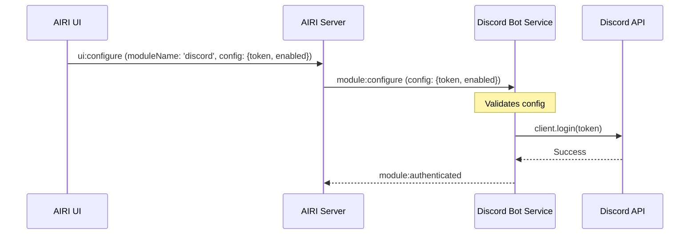

# Discord Integration

AIRI supports Discord integration through a dedicated bot service. This allows AIRI to communicate with users on Discord servers and via Direct Messages.

## Architecture

The integration follows a multi-service architecture:

1.  **AIRI Client (Frontend)**: Provides the UI for entering the Discord token and toggling the integration.
2.  **AIRI Server (Backend)**: Acts as a message broker between the UI and the Discord Bot service via WebSockets.
3.  **Discord Bot Service (`services/discord-bot`)**: A standalone Node.js process that connects to Discord and AIRI.

### Sequence Diagram: Configuration Flow



## How It Works

### 1. Connection & Authentication
The Discord Bot service connects to the AIRI WebSocket server. It waits for a `module:configure` event from AIRI, which contains the Discord token and the enabled status.

> [!NOTE]
> The AIRI UI automatically broadcasts the saved configuration whenever it loads. This allows any newly started bot to receive its token and go online without manual intervention.

Upon receiving a valid token, it logs into the Discord API using `discord.js`.

### 2. Message Processing (Discord to AIRI)
When the bot is mentioned in a channel or receives a DM:
- **Context Enrichment**: The bot gathers metadata like `guildName`, `channelId`, and the user's `displayName`.
- **Session Mapping**: It intelligently maps the conversation to a specific AIRI session ID:
    - **Server Channel**: `discord-guild-[guild-id]`
    - **Direct Message**: `discord-dm-[user-id]`
- **Prefixing**: It adds a prefix to the message (e.g., `(From Discord user Anya in Direct Message): `) so AIRI understands the context of who it's talking to and where.
- **Event Dispatch**: It sends an `input:text` event to AIRI with the enriched data.

### 3. Response Forwarding (AIRI to Discord)
When AIRI generates a reply:
- The bot service listens for `output:gen-ai:chat:message` events.
- It extracts the `channelId` from the original input context.
- It uses the Discord API to send the message back to that specific channel.
- **Chunking**: If a response exceeds Discord's 2000-character limit, the bot automatically chunks the message at the nearest newline or space to ensure it's delivered correctly.

### 4. Memory Preservation
Because Discord conversations are mapped to unique session IDs, AIRI maintains separate chat histories for every server and every DM, just like it does for local chats.

## Troubleshooting

- **Bot not responding**: Ensure the `DISCORD_TOKEN` is correct.
- **Bot remains offline**: The Discord bot requires **all** of the following Gateway Intents to be enabled in the [Discord Developer Portal](https://discord.com/developers/applications):
    - `Guilds`
    - `GuildMessages`
    - `MessageContent` (Mandatory for reading messages)
    - `DirectMessages`
- **Missing Token**: If the bot is enabled in the UI but no token is provided, the service will log a warning and wait for a valid configuration.
- **Stuck at "Waiting for configuration"**: Ensure the AIRI UI is open and authenticated. The UI uses a registry-based auto-discovery mechanism to push settings to the bot as soon as it appears online.

## Voice & Transcription

The Discord bot supports real-time voice interaction using standard OpenAI-compatible STT services.

### STT Configuration

Configure your transcription server in `services/discord-bot/.env.local`:

```env
OPENAI_STT_API_BASE_URL='http://127.0.0.1:8090/v1'
OPENAI_STT_API_KEY='sk-1234'
OPENAI_STT_MODEL='whisper-1'
```

### Voice Commands

The bot supports the following slash commands for voice interaction:

- `/summon`: Summons the bot to your current voice channel. The bot will automatically start listening and transcribing your speech.
- `/leave`: Forces the bot to leave the voice channel and stop monitoring.
- `/ping`: A simple connectivity check.

## Development Tips

### Instant Command Updates

Global slash commands in Discord can take up to an hour to propagate. For development, you can register commands for a specific guild to make them appear instantly:

1.  Find your Server (Guild) ID in Discord (Enable 'Developer Mode' in Settings > Advanced, then right-click your server icon).
2.  Add `DISCORD_GUILD_ID=your_id_here` to the `.env.local` file in `services/discord-bot`.
3.  Restart the bot.

### Environment Overrides

The bot service supports `.env.local` for local development overrides. This file is git-ignored and is the preferred place for `DISCORD_TOKEN`, `DISCORD_GUILD_ID`, and STT server URLs.
