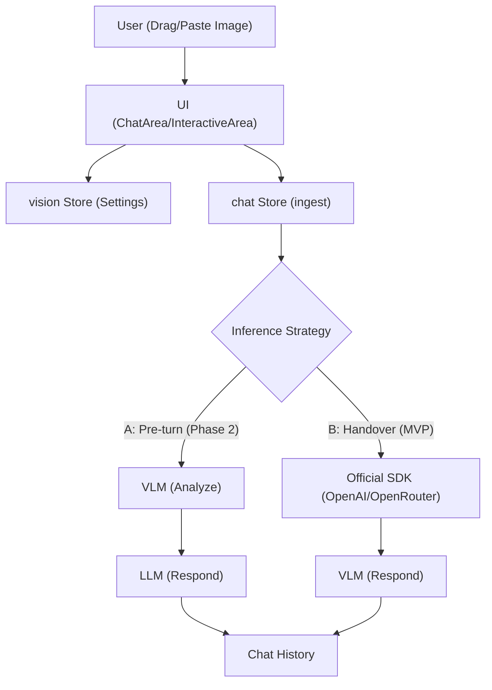

# Vision Support Comprehensive Design

This document outlines the architecture and implementation plan for decoupled vision support in AIRI.

## 1. Objective
Enable users to configure a dedicated Vision-Language Model (VLM) for processing image attachments, independent of the primary Chat LLM. This allows for cost and performance optimization (e.g., using a small LLM for chat and a high-quality model like Gemini Pro Vision for image analysis).

## 2. Terminology & Architecture
Overloading the `consciousness` store for VLM settings is avoided to maintain a clear distinction between the "Mind" (Chat LLM) and "Senses" (Vision VLM).

- **`vision` store**: A new dedicated store for VLM settings.
- **`consciousness` store**: Remains dedicated to the primary Chat LLM.

## 3. Inference Strategies

### Strategy B: Direct Handover (MVP Focus)
The VLM replaces the Chat LLM for turns containing images. This is the primary focus for the MVP as it involves less state juggling and provider coordination.
1. User sends message + images.
2. If VLM is configured and images are present, the request is routed entirely to the VLM.
3. VLM generates the response directly.
> [!IMPORTANT]
> **Implementation Note**: We will use official SDKs (`openai` and `@google/generative-ai`) to ensure robust image serialization and streaming support.

### Strategy A: Description Injection (Phase 2 / Optional)
The VLM is treated as a "describer" that provides text context for the Chat LLM.
1. User sends message + images.
2. VLM is called with the images and a prompt (e.g., "Describe these images in detail").
3. VLM response is injected as a hidden context message or appended to the User message.
4. Chat LLM responds based on the updated text context.

## 4. Affected Files & Integration Points

### 4.1 Registry & selection
- [NEW] [vision.ts](file:///c:/Users/h4rdc/Documents/Github/airi-rebase-scratch/packages/stage-ui/src/stores/modules/vision.ts): Manage `activeProvider`, `activeModel`, and `contextWindow`.
- [providers.ts](file:///c:/Users/h4rdc/Documents/Github/airi-rebase-scratch/packages/stage-ui/src/stores/providers.ts): Add `vision` category to `ProviderMetadata`.
- [converters.ts](file:///c:/Users/h4rdc/Documents/Github/airi-rebase-scratch/packages/stage-ui/src/stores/providers/converters.ts): Update `getCategoryFromTasks` to support `vision`.
- [modules/vision.vue](file:///c:/Users/h4rdc/Documents/Github/airi-rebase-scratch/packages/stage-pages/src/pages/settings/modules/vision.vue): Build the selection UI for the global VLM (Focus: OpenAI, OpenRouter).
- [providers/index.vue](file:///c:/Users/h4rdc/Documents/Github/airi-rebase-scratch/packages/stage-pages/src/pages/settings/providers/index.vue): Add a dedicated "Vision" tab to configure VLM providers (Phase 1: OpenAI, OpenRouter; Phase 2: Native Gemini).

### 4.2 Inference Logic
- [chat.ts](file:///c:/Users/h4rdc/Documents/Github/airi-rebase-scratch/packages/stage-ui/src/stores/chat.ts):
    - Update `ingest` to detect images.
    - Implement chosen strategy in `performSend`.
    - Handle image context windowing (filtering attachments based on history length).

### 4.3 Image Handling & UI
- [basic-text-area.vue](file:///c:/Users/h4rdc/Documents/Github/airi-rebase-scratch/packages/ui/src/components/form/textarea/basic-text-area.vue): Add `onDrop` support for images.
- [ChatArea.vue](file:///c:/Users/h4rdc/Documents/Github/airi-rebase-scratch/packages/stage-layouts/src/components/Widgets/ChatArea.vue):
    - Add `attachments` state.
    - Implement `handleFilePaste` and `handleFileDrop`.
    - Add image preview UI above the textarea.
- [InteractiveArea.vue](file:///c:/Users/h4rdc/Documents/Github/airi-rebase-scratch/apps/stage-tamagotchi/src/renderer/components/InteractiveArea.vue): Add `handleFileDrop` support.
- [user-item.vue](file:///c:/Users/h4rdc/Documents/Github/airi-rebase-scratch/packages/stage-ui/src/components/scenarios/chat/user-item.vue): Update to render `image_url` content parts in the chat history.

## 5. Data Flow

